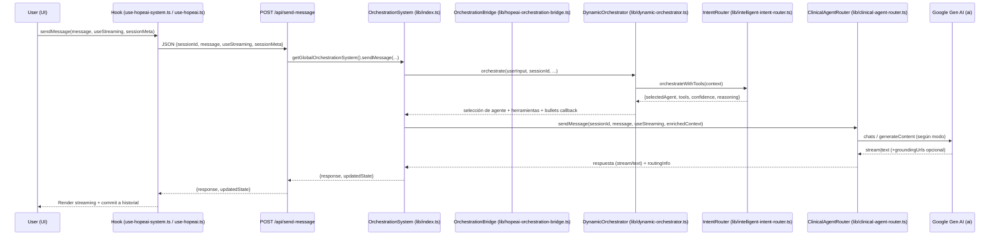
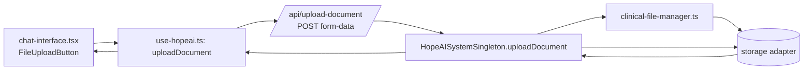
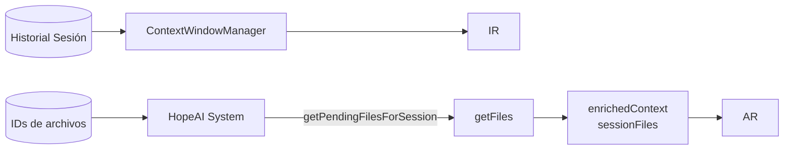
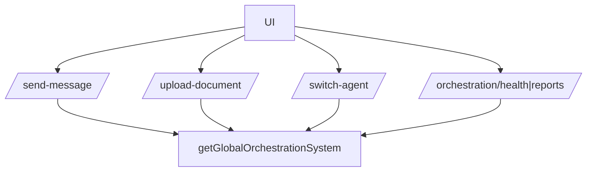

## Arquitectura de Workflows de Agentes e Instancias de IA (HopeAI)

### 1) Vista general de alto nivel

- **Objetivo**: Unificar orquestación, enrutamiento por intención y ejecución de especialistas (Socrático, Clínico, Académico) con manejo de contexto, métricas y salud del sistema.
- **Piezas clave**:
  - **UI/UX**: `components/chat-interface.tsx` + hooks (`hooks/use-hopeai-system.ts`, `hooks/use-hopeai.ts`, `hooks/use-hopeai-optimized.ts`).
  - **API**: Endpoints en `app/api/*` que invocan el orquestador singleton.
  - **Orquestación**: `lib/index.ts` (HopeAIOrchestrationSystem), `lib/hopeai-orchestration-bridge.ts`, `lib/dynamic-orchestrator.ts`, `lib/intelligent-intent-router.ts`.
  - **Agentes**: `lib/clinical-agent-router.ts` (gestión de sesiones de chat por agente y llamadas al SDK).
  - **Contexto**: `lib/context-window-manager.ts`, `lib/context-optimization-manager.ts`, `hooks/use-optimized-context.ts`, `lib/client-context-persistence.ts`.
  - **SDK**: `lib/google-genai-config.ts` expone `ai` (Google Gen AI SDK) usado en router/orquestador.

```mermaid
flowchart TD
    A[Usuario] --> B[UI Chat
    components/chat-interface.tsx]
    B --> C[Hooks
    use-hopeai-system.ts / use-hopeai.ts / use-hopeai-optimized.ts]
    C --> D[/API Next.js\n/app/api/send-message/route.ts\n/app/api/upload-document/route.ts\n/app/api/switch-agent/route.ts/]
    D --> E[Orchestration Singleton
    lib/orchestration-singleton.ts\ngetGlobalOrchestrationSystem()]
    E --> F[HopeAIOrchestrationSystem
    lib/index.ts]
    F --> G[HopeAIOrchestrationBridge
    lib/hopeai-orchestration-bridge.ts]
    G --> H[DynamicOrchestrator
    lib/dynamic-orchestrator.ts]
    H --> I[IntelligentIntentRouter
    lib/intelligent-intent-router.ts]
    I --> J[ClinicalAgentRouter
    lib/clinical-agent-router.ts]
    J --> K[Google Gen AI SDK
    lib/google-genai-config.ts\nai]
    K --> J
    J --> D
    D --> B
```

— Flujo: el mensaje del usuario viaja desde la UI a la API, que delega en el sistema de orquestación singleton. La orquestación decide agente y herramientas, y el `ClinicalAgentRouter` ejecuta la interacción con el SDK. La respuesta fluye de vuelta a UI (con soporte streaming y metadatos de enrutamiento/grounding).


### 2) Diagramas de data flow, API calls y user–AI flow (flujos de IA)

#### 2.A Envío de mensaje (texto + streaming + enrutamiento dinámico)



Notas clave basadas en código:
- `app/api/send-message/route.ts` usa `getGlobalOrchestrationSystem()` y retorna en streaming (encapsulado en `ReadableStream`).
- `lib/hopeai-system.ts` en `sendMessage` decide entre orquestación avanzada (`DynamicOrchestrator`) o routing estándar (`IntelligentIntentRouter`). Añade `routingInfo` y gestiona historial/archivos por ID.
- `components/chat-interface.tsx` procesa chunks streaming, acumula `groundingUrls`, y persiste la respuesta completa mediante `addStreamingResponseToHistory`.

#### 2.B Subida de documentos (referenciados por ID en contexto)



- `lib/hopeai-system.ts` mantiene `metadata.fileReferences` con IDs, y `getPendingFilesForSession()` sólo devuelve archivos procesados NO enviados aún.
- Durante `sendMessage`, el contexto enriquecido incluye `sessionFiles` resueltos desde IDs.

#### 2.C Cambio de agente (explícito e implícito)

```mermaid
flowchart TD
    U --> H1[use-hopeai.ts: switchAgent]
    H1 --> API1[/api/switch-agent\nPOST/]
    API1 --> OS1[getGlobalOrchestrationSystem().orchestrate(..., forceMode:'dynamic')]
    OS1 --> BR1
    BR1 --> DO1
    DO1 --> IR1
    IR1 --> BR1
    BR1 --> OS1
    OS1 --> API1
    API1 --> H1
    H1 --> U
```

- Solicitudes explícitas también se detectan en `IntelligentIntentRouter.routeUserInput()` (p. ej. "cambiar a modo clínico"), lo que dispara transición de sesión en `HopeAISystem` con instrumentación Sentry.


### 3) Archivos involucrados (.ts/.tsx) y su función

- Orquestación y routing
  - `lib/index.ts` (HopeAIOrchestrationSystem): entrypoint unificado; integra bridge, monitoring y mantenimiento; `orchestrate()` y salud/métricas.
  - `lib/hopeai-orchestration-bridge.ts`: decide `dynamic | legacy | hybrid`; invoca `DynamicOrchestrator`; gestiona métricas de puente.
  - `lib/dynamic-orchestrator.ts`: selecciona agente y herramientas vía `IntelligentIntentRouter`; genera bullets progresivos; actualiza contexto de sesión.
  - `lib/intelligent-intent-router.ts`: clasificación de intención con Function Calling del SDK; extracción de entidades; `ContextWindowManager` para optimizar contexto; mapea intención→agente y herramientas.
  - `lib/clinical-agent-router.ts`: define agentes `socratico`, `clinico`, `academico`, crea/gestiona sesiones de chat por agente y envía mensajes al SDK (streaming/no streaming).
  - `lib/orchestration-singleton.ts`: crea y expone el singleton de orquestación (config unificada y health checks de API).

- Sistema base HopeAI
  - `lib/hopeai-system.ts`: inicializa storage e intent router; integra `DynamicOrchestrator`; guarda/recupera sesiones; resuelve archivos por ID; aplica patient context; persiste historial y métricas.

- Manejo de contexto
  - `lib/context-window-manager.ts`: sliding window + preservación de referencias; estima tokens; usado por `IntelligentIntentRouter` antes de clasificar.
  - `lib/context-optimization-manager.ts`: estrategias de optimización (sliding window con preservación, compresión semántica) para conversaciones largas.
  - `hooks/use-optimized-context.ts`: crea chat nativo, `sendMessage` y `sendMessageStream` con conteo de tokens y grounding URLs; provee historias curadas/completas.
  - `lib/client-context-persistence.ts`: persistencia cliente de contexto optimizado (restauración de sesiones y métricas de uso).

- Integración con Google Gen AI SDK
  - `lib/google-genai-config.ts`: inicializa `ai` (SDK) desde env; usado por router/orquestador/entidades.
  - Usos clave: `ai.models.generateContent(...)`, `ai.chats.create().sendMessageStream(...)`, y Function Calling (`FunctionDeclaration`, `FunctionCallingConfigMode`).

- Extracción de entidades y herramientas
  - `lib/entity-extraction-engine.ts`: llama `ai.models.generateContent` con function calling para extraer entidades; agrupa/confía resultados.
  - `lib/tool-registry.ts`: registro central de herramientas clínicas (referenciado desde orquestador y router) [no detallado aquí].

- API
  - `app/api/send-message/route.ts`: entrada principal de mensajes; retorna stream JSON con respuesta y estado actualizado.
  - `app/api/upload-document/route.ts`: subida de documentos (form-data) a través de `HopeAISystemSingleton.uploadDocument(...)`.
  - `app/api/switch-agent/route.ts`: solicita cambio de agente vía orquestación dinámica.
  - `app/api/sessions/route.ts`: creación/listado (placeholder para listado completo).
  - `app/api/orchestration/health/route.ts`: health del orquestador; permite cambiar config puente/monitoring.
  - `app/api/orchestration/reports/route.ts`: reportes clínicos y programación (JSON/CSV) desde `HopeAIOrchestrationSystem`.
  - `app/api/agents/route.ts`: lista agentes disponibles desde `clinicalAgentRouter`.
  - `app/api/system-status/route.ts`: estado del singleton HopeAI optimizado y métricas del monitor.

- UI/UX y hooks
  - `components/chat-interface.tsx`: renderiza historial, streaming, grounding y bullets; inicia `sendMessage`, `uploadDocument` y gestiona adjuntos por ID.
  - `hooks/use-hopeai-system.ts`: estado del sistema, transición de estados, `sendMessage` con bullets progresivos (callback al orquestador), persistencia de historial.
  - `hooks/use-hopeai.ts`: wrapper simple cliente-API para crear sesión, enviar mensajes, cambiar agente y subir documentos.
  - `hooks/use-hopeai-optimized.ts`: sesión optimizada con `use-optimized-context` y `ClientContextPersistence` (métricas extendidas y transferencia entre agentes).


### 4) Clusters de workflows con diagramas por objetivo

#### Cluster A — Orquestación y Enrutamiento por Intención

Objetivo: Seleccionar el agente adecuado y herramientas clínicas, con métricas y fallback.

```mermaid
flowchart LR
    In[Input Usuario\nContent[] + meta] --> IR[IntelligentIntentRouter]
    IR -->|Function Calling + Entidades| Sel{Mapeo intención→agente}
    Sel --> DO[DynamicOrchestrator\noptimizaciones + bullets]
    DO --> BR[OrchestrationBridge\n(dynamic|legacy|hybrid)]
    BR --> Sys[HopeAIOrchestrationSystem]
```

Archivos: `lib/intelligent-intent-router.ts`, `lib/dynamic-orchestrator.ts`, `lib/hopeai-orchestration-bridge.ts`, `lib/index.ts`.

#### Cluster B — Ejecución del Agente y SDK

Objetivo: Ejecutar la generación (streaming o no) con el SDK y devolver respuesta enriquecida.

```mermaid
flowchart TD
    DO --> AR[ClinicalAgentRouter]
    AR -->|sendMessage| SDK[ai (Google Gen AI)]
    SDK --> AR
    AR --> Res[Respuesta\nstream/text + grounding]
```

Archivos: `lib/clinical-agent-router.ts`, `lib/google-genai-config.ts`.

#### Cluster C — Gestión de Contexto (sesión, ventanas, archivos)

Objetivo: Mantener contexto relevante, reducir tokens, referenciar archivos por ID y preservar integridad clínica.



Archivos: `lib/context-window-manager.ts`, `lib/hopeai-system.ts` (gestión de archivos/IDs), `hooks/use-optimized-context.ts`, `lib/client-context-persistence.ts`.

#### Cluster D — API y Experiencia de Usuario

Objetivo: Entregar una experiencia responsiva con streaming, adjuntos, bullets, grounding y salud del sistema.



Archivos: `app/api/*`, `components/chat-interface.tsx`, `hooks/use-hopeai*.ts`.


### 5) Diagrama dedicado de gestión de contexto

```mermaid
flowchart TD
    subgraph Client
      UI[chat-interface.tsx]
      UO[use-optimized-context.ts]
      CCP[client-context-persistence.ts]
    end

    subgraph Server
      HS[hopeai-system.ts]
      CWM[context-window-manager.ts]
      COM[context-optimization-manager.ts]
      IR[intelligent-intent-router.ts]
      DO[dynamic-orchestrator.ts]
      AR[clinical-agent-router.ts]
    end

    UI -->|mensaje + adjuntos por ID| HS
    HS -->|history→Content[]| CWM
    CWM -->|processedContext + metrics| IR
    HS -->|getPendingFilesForSession|getFilesByIds
    HS -->|sessionFiles| AR
    IR --> DO
    DO --> AR
    UO -->|sendMessage(Stream)| aiSDK[(ai.chats / ai.models)]
    aiSDK --> UO
    UO --> CCP
    CCP --> UO
```

- Reducción de contexto: `ContextWindowManager.processContext()` preserva referencias críticas y estima tokens antes de la clasificación.
- Persistencia cliente: `ClientContextPersistence` guarda/restaura el contexto optimizado (sesión activa, métricas, historiales curados).
- Archivos clínicos: `HopeAI System` referencia archivos por ID; los resuelve antes de llamar al agente y los adjunta al contexto enriquecido.


### Observaciones de alineación con Google Gen AI SDK (basado en .ts/.tsx)

- Inicialización centralizada del SDK en `lib/google-genai-config.ts` exponiendo `ai`; los módulos de enrutamiento/extracción lo consumen.
- Generación y streaming:
  - `lib/dynamic-orchestrator.ts` usa `ai.chats.create().sendMessageStream(...)` para bullets progresivos.
  - `hooks/use-optimized-context.ts` usa `sendMessageStream`/`sendMessage` y recopila `groundingUrls` si están presentes en chunks.
- Function Calling: `lib/intelligent-intent-router.ts` y `lib/entity-extraction-engine.ts` declaran/usan `FunctionDeclaration` y `FunctionCallingConfigMode` para clasificación de intención y extracción de entidades.
- Manejo de archivos: el flujo actual usa IDs y `clinical-file-manager` del lado servidor; la inyección al prompt se hace como `sessionFiles` en contexto enriquecido.


### Apéndice: referencias clave (rutas y clases principales)

- API
  - `app/api/send-message/route.ts`
  - `app/api/upload-document/route.ts`
  - `app/api/switch-agent/route.ts`
  - `app/api/sessions/route.ts`
  - `app/api/orchestration/health/route.ts`
  - `app/api/orchestration/reports/route.ts`
  - `app/api/agents/route.ts`
  - `app/api/system-status/route.ts`

- Orquestación y agentes
  - `lib/index.ts` (HopeAIOrchestrationSystem)
  - `lib/hopeai-orchestration-bridge.ts`
  - `lib/dynamic-orchestrator.ts`
  - `lib/intelligent-intent-router.ts`
  - `lib/clinical-agent-router.ts`
  - `lib/orchestration-singleton.ts`

- Contexto y optimización
  - `lib/context-window-manager.ts`
  - `lib/context-optimization-manager.ts`
  - `hooks/use-optimized-context.ts`
  - `lib/client-context-persistence.ts`

- Sistema base y SDK
  - `lib/hopeai-system.ts`
  - `lib/google-genai-config.ts`
  - `lib/entity-extraction-engine.ts`

- UI/UX
  - `components/chat-interface.tsx`
  - `hooks/use-hopeai-system.ts`
  - `hooks/use-hopeai.ts`
  - `hooks/use-hopeai-optimized.ts`


— Fin —


